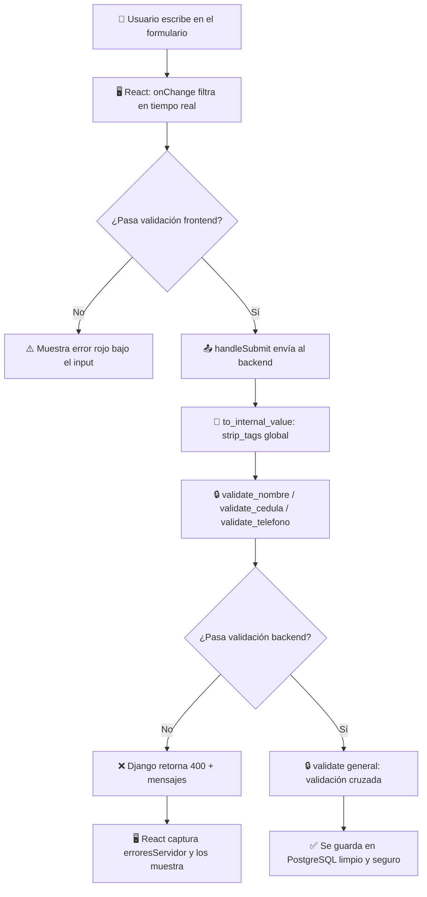

# 🛡️ Guía Paso a Paso: Validaciones y Saneamiento SGTH

> [!IMPORTANT]
> Esta guía está personalizada para tu código actual. Cada paso referencia tus archivos y líneas exactas.

---

## PARTE 1: Formateo y Validación en React (Frontend)

### Archivo: [RegisterTalent.jsx](file:///c:/Users/NicoleTolve/Documents/gestion_talentos/frontend/src/components/RegisterTalent.jsx)

---

### Paso 1.1 — Crear un estado para errores en tiempo real

**Dónde:** Línea ~137, justo después del cierre de `useState` de `formData`.

**Qué hacer:** Agregar un nuevo estado para almacenar mensajes de error por campo.

```jsx
const [errores, setErrores] = useState({
  nombre_completo: '',
  cedula: '',
  telefono: '',
});
```

**Por qué:** Este objeto tendrá un mensaje por cada campo. Si está vacío `''`, no hay error. React lo usará para mostrar/ocultar mensajes rojos debajo de cada input.

---

### Paso 1.2 — Reemplazar `handleInputChange` con lógica inteligente

**Dónde:** Líneas 224-226, tu función `handleInputChange` actual.

**Qué hacer:** Reemplazar esa función genérica con una que tenga lógica especial por campo. Aquí está el código completo:

```jsx
const handleInputChange = (e) => {
  const { name, value } = e.target;

  // ── NOMBRE COMPLETO ──
  if (name === 'nombre_completo') {
    // 1. Rechazar cualquier carácter que sea número
    const sinNumeros = value.replace(/[0-9]/g, '');

    // 2. Capitalizar cada palabra automáticamente
    const capitalizado = sinNumeros.replace(/\b\w/g, (char) => char.toUpperCase());

    // 3. Actualizar estado y limpiar/poner error
    setFormData({ ...formData, [name]: capitalizado });
    setErrores({
      ...errores,
      nombre_completo: /[0-9]/.test(value) ? 'El nombre no puede contener números.' : '',
    });
    return; // Importante: salimos aquí para no caer al setFormData genérico
  }

  // ── CÉDULA ──
  if (name === 'cedula') {
    let nuevaVal = value.toUpperCase(); // Forzar mayúscula

    // Regla 1: El primer carácter SOLO puede ser V o E
    if (nuevaVal.length === 1 && !['V', 'E'].includes(nuevaVal)) {
      setErrores({ ...errores, cedula: 'Debe iniciar con V o E.' });
      return; // No actualiza el estado, bloquea la escritura
    }

    // Regla 2: Del segundo carácter en adelante, solo números
    if (nuevaVal.length > 1) {
      const resto = nuevaVal.slice(1).replace(/\D/g, ''); // Quitar no-numéricos
      nuevaVal = nuevaVal[0] + resto;
    }

    setFormData({ ...formData, [name]: nuevaVal });
    setErrores({
      ...errores,
      cedula: nuevaVal.length > 0 && !['V', 'E'].includes(nuevaVal[0])
        ? 'Debe iniciar con V o E.'
        : '',
    });
    return;
  }

  // ── TELÉFONO ──
  if (name === 'telefono') {
    let tel = value;
    const prefijo = '+58 ';

    // Asegurar que siempre empiece con +58
    if (!tel.startsWith(prefijo)) {
      tel = prefijo; // Si intenta borrar el prefijo, se restaura
    }

    // Solo permitir números después del prefijo
    const parteUsuario = tel.slice(prefijo.length).replace(/\D/g, '');
    tel = prefijo + parteUsuario;

    // Validar patrón completo: +58 4XX XXXXXXX (11 dígitos después de +58)
    const telefonoLimpio = parteUsuario;
    let msgError = '';
    if (telefonoLimpio.length > 0 && telefonoLimpio[0] !== '4') {
      msgError = 'Después de +58, el número debe empezar con 4.';
    } else if (telefonoLimpio.length > 10) {
      msgError = 'El número no puede exceder 10 dígitos.';
      tel = prefijo + parteUsuario.slice(0, 10); // Truncar
    }

    setFormData({ ...formData, [name]: tel });
    setErrores({ ...errores, telefono: msgError });
    return;
  }

  // ── TODOS LOS DEMÁS CAMPOS (sin cambios) ──
  setFormData({ ...formData, [name]: value });
};
```

**Explicación línea por línea:**

| Concepto | Qué hace |
|---|---|
| `value.replace(/[0-9]/g, '')` | Regex que encuentra todo dígito y lo elimina del string |
| `sinNumeros.replace(/\b\w/g, char => char.toUpperCase())` | `\b\w` encuentra la primera letra de cada palabra y la capitaliza |
| `value.toUpperCase()` | Convierte la cédula a mayúscula siempre |
| `nuevaVal.slice(1).replace(/\D/g, '')` | Toma todo desde el 2do carácter y elimina lo que NO sea dígito |
| `tel.startsWith(prefijo)` | Verifica que el prefijo +58 esté intacto |
| `return` después de cada bloque | Impide que caiga al `setFormData` genérico del final |

---

### Paso 1.3 — Inicializar el teléfono con prefijo por defecto

**Dónde:** Línea 133, dentro de tu `useState` de `formData`.

**Qué hacer:** Cambiar el valor inicial del teléfono:

```diff
- telefono: '',
+ telefono: '+58 ',
```

---

### Paso 1.4 — Modificar `FormInput` para mostrar errores

**Dónde:** Líneas 36-62, el componente `FormInput`.

**Qué hacer:** Agregar una prop `error` y renderizar un `<span>` rojo debajo del input:

```jsx
const FormInput = ({label, placeholder, type = "text", value, onChange,
                    width = "100%", disabled = false, readOnly = false,
                    name, error}) => (
  <div style={{ width, marginBottom: '24px', display: 'flex', flexDirection: 'column', gap: '8px' }}>
    <label style={{ color: '#1F2937', fontSize: '14px', fontWeight: '500', fontFamily: 'Inter' }}>
      {label}
    </label>
    <input
      type={type}
      name={name}
      placeholder={placeholder}
      value={value}
      onChange={onChange}
      disabled={disabled}
      readOnly={readOnly}
      style={{
        height: '42px',
        padding: '0 16px',
        borderRadius: '8px',
        border: error ? '1px solid #EF4444' : '1px solid #E5E7EB',
        fontSize: '16px',
        fontFamily: 'Inter',
        outline: 'none',
        backgroundColor: disabled || readOnly ? '#F3F4F6' : 'white',
        color: disabled || readOnly ? '#6B7280' : 'inherit'
      }}
    />
    {error && (
      <span style={{ color: '#EF4444', fontSize: '12px', fontFamily: 'Inter' }}>
        {error}
      </span>
    )}
  </div>
);
```

**Cambios clave:**
1. Nueva prop `error` en los parámetros
2. El `border` cambia a rojo (`#EF4444`) si hay error
3. Se agrega un `<span>` condicional que solo aparece cuando `error` tiene texto

---

### Paso 1.5 — Pasar los errores a cada `FormInput`

**Dónde:** En el JSX del formulario (líneas ~347-381), agregar la prop `error` a los 3 campos.

**Nombre Completo (~línea 347):**
```jsx
<FormInput
  label="Nombre Completo *"
  placeholder="Nombres y Apellidos"
  value={formData.nombre_completo}
  onChange={handleInputChange}
  name="nombre_completo"
  error={errores.nombre_completo}  // ← AGREGAR
/>
```

**Cédula (~línea 354):**
```jsx
<FormInput
  label="Identificación *"
  placeholder="V12345678"
  width="50%"
  value={formData.cedula}
  onChange={handleInputChange}
  name="cedula"
  error={errores.cedula}  // ← AGREGAR
/>
```

**Teléfono (~línea 369):**
```jsx
<FormInput
  label="Teléfono *"
  placeholder="+58 412..."
  width="50%"
  value={formData.telefono}
  onChange={handleInputChange}
  name="telefono"
  error={errores.telefono}  // ← AGREGAR
/>
```

---

## PARTE 2: Validación en Django (Backend - models.py)

### Archivo: [models.py](file:///c:/Users/NicoleTolve/Documents/gestion_talentos/backend/talento/models.py)

---

### Paso 2.1 — Agregar imports de validadores

**Dónde:** Línea 3, agregar `RegexValidator` al import existente.

```diff
- from django.core.validators import EmailValidator, MinValueValidator, MaxValueValidator
+ from django.core.validators import EmailValidator, MinValueValidator, MaxValueValidator, RegexValidator
```

---

### Paso 2.2 — Agregar RegexValidators a los campos del modelo Candidato

**Dónde:** Líneas 61-65, modificar los campos `cedula`, `nombre_completo` y `telefono`:

**Cédula (línea 61):**
```python
    cedula = models.CharField(
        max_length=100,
        unique=True,
        db_column='numero_identificacion',
        validators=[RegexValidator(
            regex=r'^[VE]\d{6,9}$',
            message='La identificación debe comenzar con V o E seguido de 6 a 9 dígitos.'
        )]
    )
```

**Nombre completo (línea 63):**
```python
    nombre_completo = models.CharField(
        max_length=150,
        validators=[RegexValidator(
            regex=r'^[a-zA-ZáéíóúÁÉÍÓÚñÑüÜ\s]+$',
            message='El nombre solo puede contener letras y espacios.'
        )]
    )
```

**Teléfono (línea 65):**
```python
    telefono = models.CharField(
        max_length=50,
        validators=[RegexValidator(
            regex=r'^\+58\s4\d{9}$',
            message='El teléfono debe tener el formato +58 4XX XXXXXXX.'
        )]
    )
```

> [!NOTE]
> **¿Necesito hacer una migración?** Sí. Después de estos cambios, ejecuta:
> ```bash
> python manage.py makemigrations talento
> python manage.py migrate
> ```
> Los `validators` de Django no cambian la estructura de la tabla SQL, pero Django los registra en la migración de todas formas.

---

### Explicación de cada Regex

| Campo | Regex | Significado |
|---|---|---|
| Cédula | `^[VE]\d{6,9}$` | Empieza con V o E, seguido de 6 a 9 dígitos, nada más |
| Nombre | `^[a-zA-ZáéíóúÁÉÍÓÚñÑüÜ\s]+$` | Solo letras (incluyendo acentos y ñ) y espacios |
| Teléfono | `^\+58\s4\d{9}$` | Literal `+58`, un espacio, un `4`, y exactamente 9 dígitos |

---

## PARTE 3: Saneamiento en el CandidatoSerializer

### Archivo: [serializers.py](file:///c:/Users/NicoleTolve/Documents/gestion_talentos/backend/talento/serializers.py)

---

### Paso 3.1 — Agregar imports necesarios

**Dónde:** Línea 1, agregar después de los imports existentes:

```python
from rest_framework import serializers
from .models import Area, Especialidad, Candidato, Entrevista
import re
from django.utils.html import strip_tags
```

---

### Paso 3.2 — Agregar métodos `validate_<campo>` al CandidatoSerializer

**Dónde:** Dentro de la clase `CandidatoSerializer` (línea 18), **después** del método `get_area_nombre` (línea 26) y **antes** de `class Meta` (línea 28).

Agrega estos métodos uno por uno:

#### 🔒 Candado 1: `validate_nombre_completo`

```python
    def validate_nombre_completo(self, value):
        """
        CANDADO 1 - Nombre:
        1. Elimina etiquetas HTML maliciosas (<script>, etc.)
        2. Limpia espacios extras al inicio/final
        3. Fuerza formato Título (primera letra mayúscula)
        4. Rechaza si contiene números
        """
        # Anti-XSS: eliminar cualquier <tag> HTML
        value = strip_tags(value)

        # Saneamiento: espacios y capitalización
        value = value.strip().title()

        # Validación: no puede contener números
        if re.search(r'\d', value):
            raise serializers.ValidationError(
                "El nombre no puede contener números."
            )

        # Validación: no puede estar vacío después de la limpieza
        if not value:
            raise serializers.ValidationError(
                "El nombre no puede estar vacío."
            )

        return value  # Retorna el valor YA LIMPIO a la BD
```

#### 🔒 Candado 2: `validate_cedula`

```python
    def validate_cedula(self, value):
        """
        CANDADO 2 - Cédula:
        1. Elimina etiquetas HTML
        2. Elimina puntos, guiones y espacios
        3. Fuerza la letra inicial a mayúscula
        4. Valida formato V/E + números
        """
        value = strip_tags(value)

        # Eliminar caracteres que el usuario podría añadir (V-12.345.678)
        value = re.sub(r'[\s.\-]', '', value)

        # Forzar mayúscula en la primera letra
        value = value[0].upper() + value[1:] if value else value

        # Validar formato final
        if not re.match(r'^[VE]\d{6,9}$', value):
            raise serializers.ValidationError(
                "La identificación debe comenzar con V o E seguido de 6 a 9 dígitos. Ejemplo: V12345678"
            )

        return value
```

#### 🔒 Candado 3: `validate_telefono`

```python
    def validate_telefono(self, value):
        """
        CANDADO 3 - Teléfono:
        1. Elimina etiquetas HTML
        2. Si falta el espacio después de +58, lo inserta
        3. Valida el formato internacional venezolano
        """
        value = strip_tags(value)

        # Insertar espacio si el usuario escribió +584121234567
        if value.startswith('+58') and len(value) > 3 and value[3] != ' ':
            value = '+58 ' + value[3:]

        # Eliminar espacios extras internos (pero preservar el de +58 X)
        partes = value.split()
        if len(partes) >= 2:
            value = partes[0] + ' ' + ''.join(partes[1:])

        # Validar formato final
        if not re.match(r'^\+58\s4\d{9}$', value):
            raise serializers.ValidationError(
                "El teléfono debe tener el formato +58 4XX XXXXXXX. Ejemplo: +58 4121234567"
            )

        return value
```

#### 🔒 Candado 4: `validate_email` (unicidad)

```python
    def validate_email(self, value):
        """
        CANDADO 4 - Email:
        1. Limpia HTML y espacios
        2. Fuerza minúsculas
        3. Verifica que sea único en la BD
        """
        value = strip_tags(value).strip().lower()

        # Verificar unicidad (excluir el candidato actual si es update)
        candidato_actual = self.instance
        qs = Candidato.objects.filter(email=value)
        if candidato_actual:
            qs = qs.exclude(pk=candidato_actual.pk)
        if qs.exists():
            raise serializers.ValidationError(
                "Ya existe un candidato registrado con este correo electrónico."
            )

        return value
```

---

### Paso 3.3 — Agregar el método `validate` general (validaciones cruzadas)

**Dónde:** Después de todos los `validate_<campo>`, pero aún dentro de `CandidatoSerializer`:

```python
    def validate(self, data):
        """
        CANDADO GENERAL - Validaciones cruzadas entre campos:
        Si hay aspiración salarial, la moneda es obligatoria.
        """
        aspiracion = data.get('aspiracion_salarial')
        moneda = data.get('moneda')

        if aspiracion and not moneda:
            raise serializers.ValidationError({
                'moneda': 'Si indica una aspiración salarial, debe seleccionar una moneda (USD/EUR).'
            })

        return data
```

---

### Paso 3.4 — Saneamiento genérico anti-XSS para TODOS los campos de texto

**Dónde:** Agregar este método también dentro de `CandidatoSerializer`, antes de los `validate_<campo>`:

```python
    def to_internal_value(self, data):
        """
        ESCUDO GLOBAL: Antes de que cualquier dato llegue a los validadores,
        limpiamos todos los campos de texto de posibles tags HTML.
        """
        cleaned = super().to_internal_value(data)
        for field_name, value in cleaned.items():
            if isinstance(value, str):
                cleaned[field_name] = strip_tags(value)
        return cleaned
```

> [!WARNING]
> `to_internal_value` se ejecuta **antes** que los `validate_<campo>`. Es tu primera línea de defensa.

---

## PARTE 4: UX — Mostrar errores del backend en React

### Archivo: [RegisterTalent.jsx](file:///c:/Users/NicoleTolve/Documents/gestion_talentos/frontend/src/components/RegisterTalent.jsx)

---

### Paso 4.1 — Agregar un estado para errores del servidor

**Dónde:** Junto al estado `errores` que creaste en el Paso 1.1:

```jsx
const [erroresServidor, setErroresServidor] = useState({});
```

---

### Paso 4.2 — Modificar el `handleSubmit` para capturar errores

**Dónde:** Líneas 269-280, tu bloque `try/catch` actual. Reemplázalo:

```jsx
try {
  const respuesta = await api.post('candidatos/', pack, {
    headers: { 'Content-Type': 'multipart/form-data' }
  });
  alert("¡Candidato registrado con éxito!");
  setErroresServidor({});  // Limpiar errores previos

} catch (error) {
  console.error("Detalle del error:", error.response?.data || error);

  if (error.response?.data) {
    // Django devuelve un objeto {campo: ["mensaje"]}
    setErroresServidor(error.response.data);
  } else {
    alert("Error de conexión. Intenta de nuevo.");
  }
}
```

---

### Paso 4.3 — Combinar errores frontend + backend en cada input

**Dónde:** En cada `<FormInput>`, la prop `error` debe mostrar el error local O el del servidor:

```jsx
<FormInput
  label="Nombre Completo *"
  placeholder="Nombres y Apellidos"
  value={formData.nombre_completo}
  onChange={handleInputChange}
  name="nombre_completo"
  error={errores.nombre_completo || erroresServidor.nombre_completo?.[0]}
/>
```

Aplica el mismo patrón para `cedula` y `telefono`:
- `error={errores.cedula || erroresServidor.cedula?.[0]}`
- `error={errores.telefono || erroresServidor.telefono?.[0]}`

Y para email (solo errores del servidor):
- `error={erroresServidor.email?.[0]}`

> [!TIP]
> Django devuelve los errores como arrays: `{"cedula": ["mensaje1", "mensaje2"]}`. Por eso usamos `?.[0]` para tomar solo el primer mensaje.

---

## PARTE 5: Resumen Visual del Flujo de Seguridad



---

## Checklist de Implementación

| # | Tarea | Archivo | Estado |
|---|---|---|---|
| 1 | Estado `errores` para frontend | RegisterTalent.jsx | ⬜ |
| 2 | `handleInputChange` inteligente | RegisterTalent.jsx | ⬜ |
| 3 | Prefijo `+58 ` en formData | RegisterTalent.jsx | ⬜ |
| 4 | Prop `error` en `FormInput` | RegisterTalent.jsx | ⬜ |
| 5 | Pasar `error` a cada campo | RegisterTalent.jsx | ⬜ |
| 6 | Import `RegexValidator` | models.py | ⬜ |
| 7 | Validators en cedula/nombre/telefono | models.py | ⬜ |
| 8 | `makemigrations` + `migrate` | Terminal | ⬜ |
| 9 | Imports en serializers.py | serializers.py | ⬜ |
| 10 | `to_internal_value` anti-XSS | serializers.py | ⬜ |
| 11 | `validate_nombre_completo` | serializers.py | ⬜ |
| 12 | `validate_cedula` | serializers.py | ⬜ |
| 13 | `validate_telefono` | serializers.py | ⬜ |
| 14 | `validate_email` | serializers.py | ⬜ |
| 15 | `validate` general (cruzada) | serializers.py | ⬜ |
| 16 | Estado `erroresServidor` | RegisterTalent.jsx | ⬜ |
| 17 | `handleSubmit` captura errores | RegisterTalent.jsx | ⬜ |
| 18 | Combinar errores en props | RegisterTalent.jsx | ⬜ |

---

> [!CAUTION]
> **Sobre LOPD (Protección de Datos):** Con este sistema, los datos erróneos **nunca llegan a la base de datos**. React los bloquea en el frontend, y Django los rechaza en el backend. Esto cumple con el principio de "calidad del dato" de la LOPD: solo se almacena información verificada y saneada.
